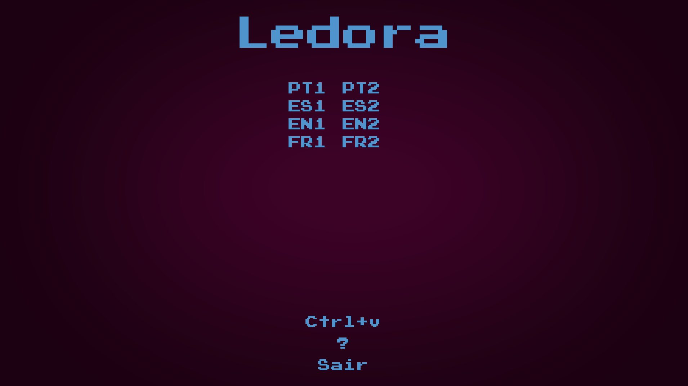
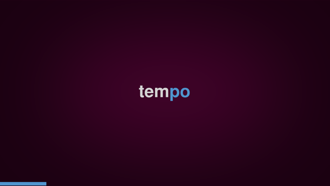
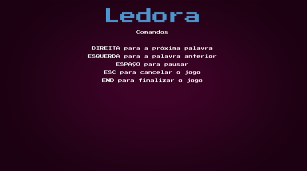
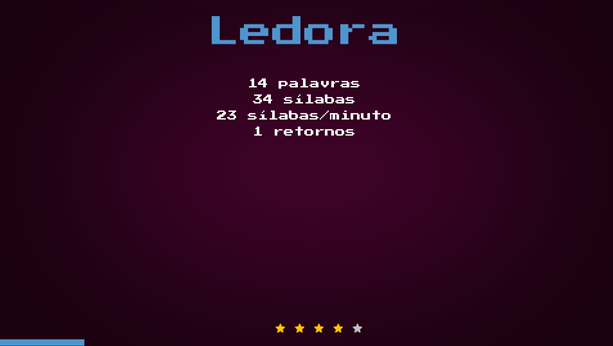

# Ledora - A game to help dyslexic children to improve their reading skills

[](https://creativecommons.org/licenses/by-nc/4.0/)

This repository contains the source code for the leDora project.

The Ledora project is a software application designed to assist professionals in improving the reading
skills of dyslexic children. Dyslexia is a learning disorder that affects reading, spelling, and writing 
abilities. This project aims to provide a supportive environment for dyslexic children to enhance their 
reading skills through targeted exercises and interactive learning methods.

This preliminary version of the leDora project is a gaming application that uses a series of exercises
that aim to speed up the reading process and improve the reading skills of dyslexic children.

The game session must be overseen and operated  by a professional who can monitor the child's progress.

## How to download binaries

The binaries are available in the following link:

* Windows 64 bits: [version 1.0.0](https://jaimenms-public-binaries.s3.amazonaws.com/ledora/ledora_1_0_windows_64bits.exe)
* macOS (Homebrew): work in progress
* macOS (tar): work in progress

## How to play

The first screen that you will see is the main window of the game. It looks like this:



Now you can choose the language (PT, ES, EN or FR) and the level 1 (frequent words) or level 2 (hard words) and start the game.

Another possibility is to us words that are available in the clipboard of the computer. For that, your
need to copy a text and then click in Ctrl+v button to start the game using the words in the clipboard.

After you choose the language and the level (or the clipboard option), the game will start with a countdown and
you will see a word in the screen. 



As you can see this word is printed in different colors based on the syllable (it helps the dyslexic children to read the word).
The word will be hidden after a fraction of seconds (the time is defined by the size of the word considering 0.1 seconds
per character in the word and a minimum of 0.5 seconds).

The player needs to read the word and the professional will evaluate if it is correct or not:
- If correct will press the _right arrow key_ to go to the next word.
- If incorrect will press the _left arrow key_ to go to present again the word.
- If wants to conclude the game, he/she can press the _end key_.
- If wants to quit the game, he/she can press the _esc key_.
- If wants to pause the game and show the word without the time limitation, he/she can press the _space key_.

To access these instructions you can click _?_ option in the main screen as follows:



The game will finish when the professional press the _end key_ or when all the words are presented. In the end, 
the game will show the number of words, the number of syllables, the reading rate in terms of syllables per minute
and the number of times a word was repeated.



Additionally, the screen will show stars based on the reading rate as follows:
- loose 1 star if the number of fails is greater than 0
- loose 1 star if the number of fails is greater than 30% of the number of words
- loose 1 star if the duration of the game is greater than the number of words multiplied by 1 second
- loose 1 star if the duration of the game is greater than the number of words multiplied by 2 seconds


## How it was implemented

The main script is called [ledora.py](ledora.py) and it is implemented using the pygame library.
it provides interactive features for users to practice reading words in different languages and types.

Let's break down what the code does:

1. Imports: The script imports various modules such as sys, os, pygame, pyphen, time, datetime, random, re, and pyperclip to facilitate different functionalities of the program.

2. Constants and Configuration: It sets up various constants like the path to assets, word duration, application name, version, font color, and logo file. It also initializes the environment variable 'SDL_VIDEO_CENTERED' to center the game window on the screen.

3. Words Mapping: This dictionary WORDS_MAPPING contains mappings for different languages and types of words (frequent or hard) along with their associated properties.

4. Helper Functions: It defines several helper functions like resource_path, asset_item_path, and get_font to facilitate resource management, especially for fonts and assets.

5. Button Class: This class defines a customizable button for the GUI interface of the program. It manages the button's appearance, position, and interaction.

6. Ledora Class: This is the main class of the program. It manages the game state, initializes pygame, sets up the screen, handles user input, and controls the flow of the program. 

7. Main Function: It creates an instance of the Ledora class and starts the game by calling the screen_initial method.

## How to install the application

The application is currently available as a exe file that can be accessed using the following link:

TODO: Add link to the application

## Preparing the local environment for development

### 1. Install Python

If Python is not already installed on your system, download and install Python from the official Python website. 
Ensure that you select the option to add Python to your system's PATH during installation.

### 2. Create a Virtual Environment

Navigate to the root directory of the project in your terminal or command prompt. Then, follow these steps to 
create a Python virtual environment:

```shell
# Navigate to the project directory
cd ledora

# Create a virtual environment named 'env'
python -m venv env
```

### 3. Activate the Virtual Environment

Activate the virtual environment by running the appropriate command for your operating system:

On Windows:

```shell
.\env\Scripts\activate
```

On macOS and Linux:

```shell
source env/bin/activate
```

### 4. Install Dependencies

Once the virtual environment is activated, install the required dependencies using the pip package manager and the provided requirements.txt file:

```shell
pip install -r requirements.txt
```


### 5. Verify Installation

To verify that the installation was successful, you can run the following command to display the installed packages along with their versions:

```shell
pip list
```

### 6. Deactivate the Virtual Environment

Once you have finished working with the project, you can deactivate the virtual environment by running the following command:

```shell
deactivate
```

## How to run the application

To run the application, you can execute the main script using the Python interpreter:

```shell
python ledora.py
```

## How to build the application

To build the application, you can use the `pyinstaller` package to create a standalone executable file.

```shell
pyinstaller ledora.spec
```

or 

```shell
pyinstaller --onefile --noconsole --add-data "assets;assets" --add-data "txts;txts" --add-data "external;external" ledora.py
```

## Future improvements

- Add more languages
- Add more levels
- Add multilanguage wording in the game interface
- SUPER FUTURE: Add a database to store the results of the game and the evolution of the player
- SUPER FUTURE: Add voice recognition to evaluate the reading of the player

## Acknowledgements

- Pygame community
- Pyperclip developer (Al Sweigart)
- Pyphen contributors

## License

This project is licensed under the CC BY-NC (Attribution-NonCommercial) license

## Final words

I hope you enjoy the game and that it can help dyslexic children to improve their reading skills.

My main inspiration to develop this game was my daughter, who is dyslexic, and I am always looking for ways to help her 
to improve her reading skills. I hope this game can help other children as well.

And Dora, if in the future you are reading this, I love you and I am very proud of you. Father.